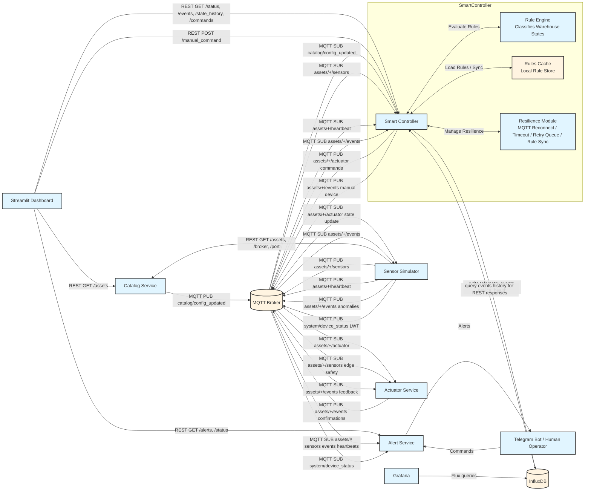

# Containerized Smart IoT System

A containerized smart warehouse platform that simulates warehouse telemetry, applies rule-based control logic, stores time-series data in InfluxDB, and visualizes live operations in Grafana and Streamlit.

## What the project does

The platform models three warehouse types (`warehouse_cold`, `warehouse_standard`, `warehouse_hazard`) and runs a full control loop:

1. The Catalog Service stores registered warehouses and their thresholds.
2. The Sensor Simulator reads the catalog and publishes telemetry, anomaly events, and heartbeats over MQTT.
3. The Smart Controller consumes those MQTT messages, evaluates rules, publishes actuator commands, and stores telemetry and events in InfluxDB.
4. The Actuator Service simulates local warehouse responses and sends confirmation events back into the platform.
5. The Alert Service sends Telegram notifications and handles operator bot commands.
6. Grafana and Streamlit expose the system state to an operator.

## Current feature set

- Docker Compose deployment for the full stack
- MQTT-based telemetry and command loop
- Config-driven warehouse rules from the catalog
- Rule states: `NORMAL`, `WARNING`, `CRITICAL`, `OVERLOAD`, `ANOMALY`
- Warehouse-specific anomaly burst simulation
- Device heartbeat monitoring with online/offline detection
- InfluxDB storage for telemetry, events, and device health
- Actuation trace in InfluxDB for command dispatch plus confirmation proof
- Grafana dashboard with connectivity annotations
- Streamlit operations dashboard using REST data from Catalog, Controller, and Alert Service, with Grafana access
- Telegram bot for push alerts and operator commands
- Automated smoke test for end-to-end build proof
- Unit tests for the controller rule engine

## Architecture



### Key Architecture Features

1. **Microservice Architecture**: Clear separation of concerns, each service has single responsibility
2. **MQTT + REST Hybrid**:
   - MQTT for real-time streams (sensors, events, commands, heartbeats)
   - REST for configuration & human-facing UI
3. **Closed-Loop Control**: Sense → Decide → Act → Verify (via actuator confirmations!)
4. **Device Health Monitoring**: Controller tracks warehouse heartbeats and detects offline devices
5. **Observability & Traceability**: All data (telemetry, events, health) stored historically in InfluxDB
6. **Resilience Features**:
   - MQTT auto reconnect
   - Rule synchronization with Catalog
   - Command timeout detection
   - InfluxDB retry queue
7. **Rules Cache**: Controller maintains local rule store for reliability if Catalog is unavailable

Important diagram rule: Streamlit is not receiving pushed data through WebSocket or SSE. Streamlit polls REST endpoints when the page refreshes. Therefore the REST arrows point from Streamlit to Catalog, Controller, and Alert Service.

## Services and responsibilities

| Service             | Path                    | Responsibility                                                    | Port                            |
| ------------------- | ----------------------- | ----------------------------------------------------------------- | ------------------------------- |
| MQTT Broker         | `mqtt-broker/`          | Message transport for telemetry, events, heartbeat, and actuation | `${MQTT_HOST_PORT:-1883}`       |
| Catalog Service     | `catalog-service/`      | Source of truth for warehouse registry and thresholds             | `${CATALOG_HOST_PORT:-8080}`    |
| Sensor Simulator    | `sensor-simulator/`     | Publishes warehouse telemetry and anomaly bursts                  | internal only                   |
| Smart Controller    | `controller-service/`   | Rule engine, MQTT orchestrator, InfluxDB writer                   | `${CONTROLLER_HOST_PORT:-8001}` |
| Actuator Service    | `actuator-service/`     | Simulated device actions and confirmation events                  | internal only                   |
| Alert Service       | `alert-service/`        | Telegram push alerts and human bot commands                       | `${ALERT_HOST_PORT:-5002}`      |
| InfluxDB            | managed image           | Time-series storage                                               | `${INFLUXDB_HOST_PORT:-8086}`   |
| Grafana             | `grafana/provisioning/` | Provisioned dashboards and annotations                            | `${GRAFANA_PORT:-3100}`         |
| Streamlit Dashboard | `dashboard/`            | Operator UI that polls REST APIs and links to Grafana/InfluxDB    | `${DASHBOARD_PORT:-18501}`      |

## Repository map

```text
.
|- docker-compose.yml
|- .env.example
|- interfaces_specification.txt
|- README.md
|- get_chat_id.py
|- manage_warehouses.py
|- scripts/
|  |- smoke_test.py
|- tests/
|  |- test_controller_rules.py
|- mqtt-broker/
|  |- mosquitto.conf
|- catalog-service/
|  |- catalog_service.py
|  |- catalog.json
|  |- requirements.txt
|  |- Dockerfile
|- sensor-simulator/
|  |- sensor_simulator.py
|  |- requirements.txt
|  |- Dockerfile
|- controller-service/
|  |- controller_service.py
|  |- rule_engine.py
|  |- rules_cache.json
|  |- requirements.txt
|  |- Dockerfile
|- actuator-service/
|  |- actuator_service.py
|  |- requirements.txt
|  |- Dockerfile
|- alert-service/
|  |- alert_service.py
|  |- requirements.txt
|  |- Dockerfile
|  |- data/
|- dashboard/
|  |- dashboard.py
|  |- requirements.txt
|  |- Dockerfile
|  |- .streamlit/config.toml
|- grafana/
|  |- provisioning/
|     |- datasources/datasource.yml
|     |- dashboards/dashboard.yml
|     |- dashboards/warehouse_dashboard.json
|- database/
   |- influxdb.env
```

## Helper Scripts

### `get_chat_id.py`

Helps you retrieve your Telegram chat ID to configure the alert service:

1. Send `/start` to your Telegram bot
2. Run: `python get_chat_id.py`
3. Copy the chat ID into your `.env` file

### `manage_warehouses.py`

Demonstrates how to dynamically add new warehouses to the catalog:

- Lists current warehouses
- Adds a new example warehouse
- The sensor simulator will automatically start simulating the new warehouse!

## MQTT contract

See [interfaces_specification.txt](./interfaces_specification.txt) for the complete contract.

Main topics:

- `assets/{asset_id}/sensors`
- `assets/{asset_id}/actuator`
- `assets/{asset_id}/events`
- `assets/{asset_id}/heartbeat`
- `catalog/config_updated`

Telegram commands:

- `/start` - Welcome message and subscribe to alerts
- `/help` - Show available commands
- `/status` - System status overview
- `/warehouses` - List all warehouses with live data
- `/alerts` - Show recent alerts
- `/subscribe` - Subscribe to alerts
- `/unsubscribe` - Unsubscribe from alerts
- `/mute <minutes>` - Mute alerts for N minutes (default: 10)
- `/unmute` - Unmute alerts immediately

## InfluxDB schema

Bucket: `warehouse_metrics`

Measurements:

- `warehouse`: telemetry plus controller state
- `warehouse_event`: anomaly events, device events, actuator command dispatches, actuator confirmations
- `device_health`: online/offline time series and last-seen age

## Run the project

### Prerequisites

- Docker Desktop
- Docker Compose v2
- Python 3.10+ if you want to run the local tests/scripts from the host

### Start the stack

```powershell
powershell -ExecutionPolicy Bypass -File .\scripts\start_stack.ps1
```

The startup script avoids Windows excluded-port failures by selecting a usable Grafana host port and writing it to `.env`. If you prefer plain Compose, run `docker compose up --build -d` after confirming `GRAFANA_PORT` is not reserved or already in use.

### Configure Telegram

Create a local `.env` file next to `docker-compose.yml`:

```text
TELEGRAM_TOKEN=your_bot_token
TELEGRAM_CHAT_ID=
```

`TELEGRAM_CHAT_ID` is optional because the bot auto-registers a chat when you send `/start`.
An `.env.example` template is included in the repo.

### Stop the stack

```powershell
docker compose down
```

### Reset the stack including InfluxDB data

```powershell
docker compose down -v
```

## Health and operator URLs

- Catalog Service: `http://localhost:${CATALOG_HOST_PORT:-8080}`
- Controller Service: `http://localhost:${CONTROLLER_HOST_PORT:-8001}`
- InfluxDB: `http://localhost:${INFLUXDB_HOST_PORT:-8086}`
- Grafana: `http://localhost:${GRAFANA_PORT:-3100}` by default, or the port configured as `GRAFANA_PORT` in `.env`
- Streamlit Dashboard: `http://localhost:${DASHBOARD_PORT:-18501}` (or your configured `DASHBOARD_PORT`)
- Telegram Bot: `@smartwarehouse_alert_bot`

Health endpoints:

- Catalog: `http://localhost:${CATALOG_HOST_PORT:-8080}/health`
- Controller: `http://localhost:${CONTROLLER_HOST_PORT:-8001}/health`
- Dashboard: `http://localhost:${DASHBOARD_PORT:-18501}/_stcore/health`
- Grafana: `http://localhost:${GRAFANA_PORT:-3100}/api/health` by default, or `http://localhost:{GRAFANA_PORT}/api/health`
- InfluxDB: `http://localhost:${INFLUXDB_HOST_PORT:-8086}/health`

## Automated verification

### Unit tests

These validate the controller rule engine without needing Docker:

```powershell
python -m unittest discover -s tests -p "test_*.py"
```

### Smoke test

This checks the running stack and proves the full control loop:

- required services are running
- Catalog and Controller APIs respond
- Grafana and Streamlit are healthy
- Alert Service is running
- InfluxDB contains recent telemetry
- a test anomaly is injected through MQTT
- the controller records an anomaly in InfluxDB
- the actuator receives the command and logs the action

Run it with:

```powershell
python scripts\smoke_test.py
```

## Build-proof checklist

Use this when submitting the project or preparing a demo:

1. `powershell -ExecutionPolicy Bypass -File .\scripts\start_stack.ps1`
2. `docker compose ps`
3. `python -m unittest discover -s tests -p "test_*.py"`
4. `python scripts\smoke_test.py`
5. Open Streamlit, Grafana, and InfluxDB UI
6. Take screenshots of:
   - running containers
   - Streamlit dashboard
   - Grafana dashboard
   - InfluxDB Data Explorer
   - smoke test success output

## Design notes

### Why the catalog matters

The catalog is the system's configuration source of truth. The simulator reads assets from it, and the controller bootstraps warehouse thresholds from it. That means the platform can be expanded without changing service code.

### Why anomaly burst mode exists

Single anomalous messages are too brief to be visually convincing when a simulator publishes every two seconds. Burst mode keeps an anomaly active across several messages so both the controller and dashboards reliably capture it.

### Why device health is stored separately

`device_health` is intentionally split from normal telemetry. That makes it easier to build clear Grafana panels for online/offline status without mixing connectivity with temperature and stock data.

### Why actuator confirmations are written to InfluxDB

Actuator confirmations make the control loop observable. They prove that the controller did not just decide something internally; the downstream service received and processed the command.

### Why the Telegram bot matters

The bot adds a human notification layer and a lightweight control-room chat interface. That makes the platform look much closer to a real industrial IoT system where automation and operators work together.

### Why actuator confirmations return through MQTT

The actuator publishes confirmation events back to the MQTT broker on `assets/{asset_id}/events`. This is intentional: the message re-enters the system so the controller can verify the action, remove the pending command, store proof in InfluxDB, and expose the result to the dashboard. Without this feedback message, the controller would only know that it sent a command, not that the actuator processed it.

### Telegram command scope

The Telegram bot currently supports `/start`, `/status`, `/alerts`, `/subscribe`, `/unsubscribe`, and `/help`. Runtime actuator commands are sent from the Streamlit dashboard through `POST /manual_command`; Telegram receives notifications about those manual commands and safety alerts.

## Production-vs-demo notes

This repository is optimized for a coursework demo, not production hardening.

Demo-friendly choices:

- anonymous Grafana viewer mode for embedding in Streamlit
- open local MQTT broker with anonymous access
- tokens kept in compose for reproducibility

If you want to productionize it later, the next steps are:

- move secrets to an `.env` file or secret manager
- secure MQTT with auth/TLS
- remove anonymous Grafana access
- move catalog state from JSON to a small database
- add CI and integration-test automation

## Remaining improvement ideas

If you want to push the project even further, the next strongest upgrades would be:

1. Add CI to run unit tests and the smoke test automatically.
2. Add Grafana template variables so dashboards can filter by warehouse.
3. Add more alerting integrations such as email or webhooks alongside Telegram.
4. Add historical reporting or export features in Streamlit.
5. Move the catalog from JSON storage to PostgreSQL or SQLite for transactional updates.
